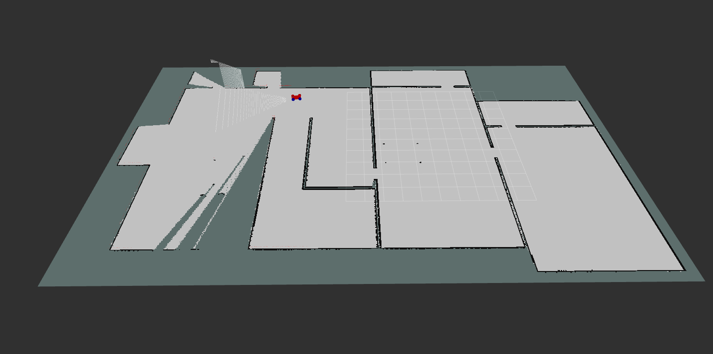
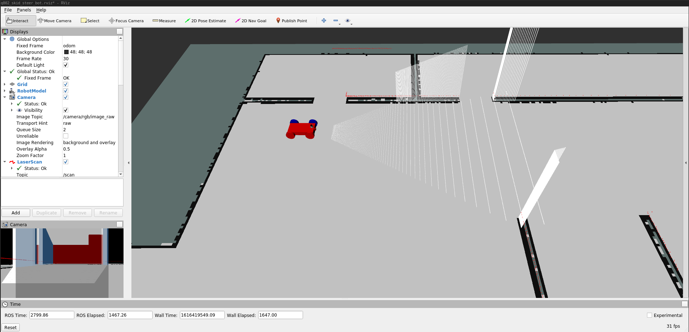
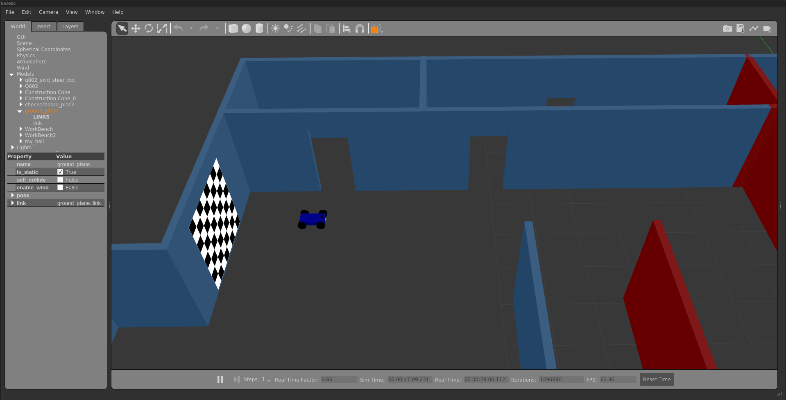

# MapMyQ802
SLAM with RTAB-Map in ROS1-noetic






### Install

RTAB-Map is released as binaries in the ROS distribution.

```bash
sudo aptitude install ros-noetic-rtabmap-ros
```
### Launch

```bash

# Launches gazebo, rviz and spawns the robot
roslaunch map_my_q802 world.launch 
```

```bash
# the teleop node
rosrun teleop_twist_keyboard teleop_twist_keyboard.py 
```

```bash
# the rtab mapping node
roslaunch map_my_q802 mapping.launch 
```

### Database Analysis
[rtabmap-databaseViewer](https://github.com/introlab/rtabmap/wiki/Tools#database-viewer)
is a great tool for exploring your database when you are done generating it. It is isolated
from ROS and allows for complete analysis of your mapping session.
- Constraints View
- Graph View
- Occupancy Grid

```base
# for example
rtabmap-databaseViewer ../MapMyQ802/map_my_q802/map/rtabmap.db
```

### Further Reading

- [On Actively Closing Loops in Grid-based FastSLAM](http://ais.informatik.uni-freiburg.de/publications/papers/stachniss05ar.pdf)
- [Autonomous Robotic Exploration Using Occupancy Grid Maps and Graph SLAM](https://www.seas.upenn.edu/~pdames/media/CarilloEtal2015.pdf)
- [ROS Navigation Basics - Clearpath Robotics](http://www.clearpathrobotics.com/assets/guides/kinetic/ros/ROS%20Navigation%20Basics.html)
- [Mapping and Localization Tutorial with Turtlebot](https://ocw.tudelft.nl/course-lectures/3-3-3-mapping-and-localization-tutorial/)
- [ROS gmapping](http://wiki.ros.org/Robots/PMB-2/Tutorials/Navigation/Mapping)
- [Editing a gmapping-derived map](https://www.theconstructsim.com/ros-qa-136-how-to-edit-a-map-generated-with-gmapping/)